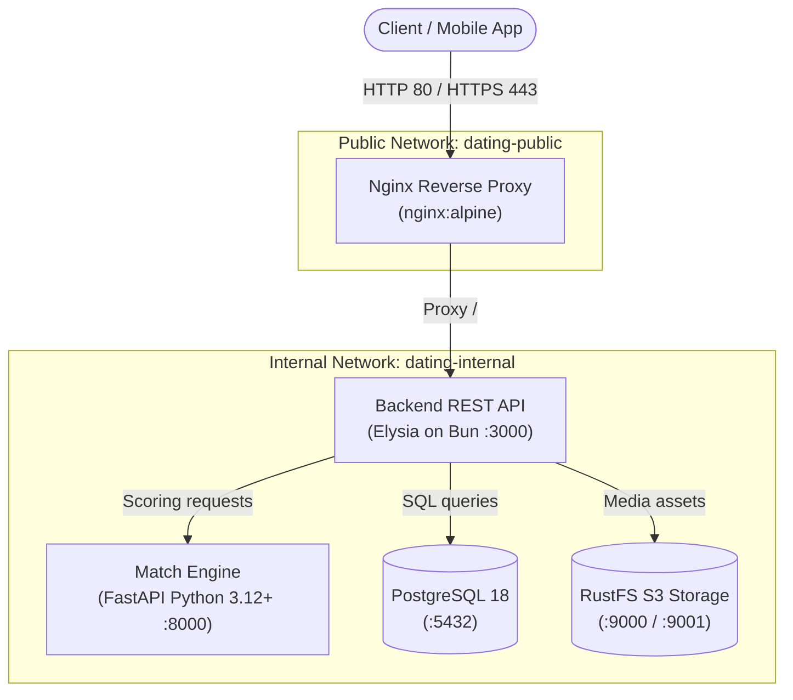

# dating-infra

> **Online Dating System (SEN-201)**  
> **Team:** Mai Ru (`Mai-Ru-Software-House`)  
> **Repository:** [dating-infra](https://github.com/Mai-Ru-Software-House/dating-infra)

Centralized Docker container orchestration, network routing, and local/production infrastructure for the Online Dating System microservices suite.

---

## Table of Contents

- [System Architecture](#system-architecture)
- [Repository Structure](#repository-structure)
- [Prerequisites](#prerequisites)
- [Configuration & Secret Management](#configuration--secret-management)
- [Environments](#environments)
  - [Development Environment](#development-environment)
  - [Production Environment](#production-environment)
- [Service Registry & Port Mappings](#service-registry--port-mappings)

---

## System Architecture

The infrastructure orchestrates five containerized services across two Docker bridge networks (`dating-public` and `dating-internal`) to enforce security boundaries and network isolation:



### Components

| Service | Technology | Role |
|---|---|---|
| **Nginx** | `nginx:alpine` | Gateway reverse proxy, SSL termination, and static/header management |
| **API** | TypeScript / Elysia on Bun | Core REST API, user profiles, chat messages, and business logic |
| **Match Engine** | Python 3.12+ / FastAPI | High-performance candidate ranking and score computation |
| **PostgreSQL** | `postgres:18` | Primary relational database for user records, swipes, and chats |
| **RustFS** | `rustfs/rustfs:latest` | S3-compatible high-performance object storage for photos and media |
| **Watchtower** | `containrrr/watchtower` | Automated container updater for pulling updated images and restarting services (Dev only) |

---

## Repository Structure

```text
dating-infra/
├── .env.example              # Dummy environment variable template (committed)
├── .gitignore                # Protects secrets (.env), OS artifacts, and certs
├── MaiRu_CodingStandards.md  # Team-wide standards and style specifications
├── README.md                 # Project and infrastructure documentation
├── docker-compose.dev.yaml   # Compose configuration for local development
├── docker-compose.prod.yaml  # Compose configuration for production deployments
└── nginx/
    ├── certs/                # SSL/TLS certificates directory (ignored by git)
    │   └── .gitkeep
    ├── nginx.dev.conf        # Nginx configuration for development
    └── nginx.prod.conf       # Nginx configuration for production
```

---

## Prerequisites

Ensure you have the following installed on your host system:

- [Docker Engine](https://docs.docker.com/engine/install/) (v24.0+)
- [Docker Compose](https://docs.docker.com/compose/) (v2.20+)
- Access to the GitHub Container Registry (`ghcr.io/mai-ru-software-house`)

Authenticate with GitHub Container Registry to pull private service images:

```bash
echo $CR_PAT | docker login ghcr.io -u YOUR_GITHUB_USERNAME --password-stdin
```

---

## Configuration & Secret Management

In accordance with **Mai Ru Coding Standards (Rule 4)**:
> *Never commit secrets. Read them from environment variables; commit a `.env.example` with dummy values only.*

### 1. Create Local `.env`

Copy the provided template to create your untracked `.env` file:

```bash
cp .env.example .env
```

### 2. Environment Variables Specification

| Variable | Description | Example / Default |
|---|---|---|
| `POSTGRES_PASSWORD` | Password for PostgreSQL user `app` | `your_secure_password` |
| `RUSTFS_ACCESS_KEY` | Access key for S3 RustFS storage | `32-character-hex-string` |
| `RUSTFS_SECRET_KEY` | Secret key for S3 RustFS storage | `32-character-hex-string` |
| `BACKEND_IMAGE` | Docker image tag for backend API service | `ghcr.io/mai-ru-software-house/dating-backend:dev` |
| `MATCH_ENGINE_IMAGE`| Docker image tag for Match Engine service | `ghcr.io/mai-ru-software-house/dating-match-engine:dev` |
| `MATCH_ENGINE_URL`  | Internal Match Engine URL for API service | `http://match-engine:8000` |
| `BACKEND_URL`       | Internal Backend API URL for Match Engine | `http://api:3000` |
| `ARGON2_MEMORY_COST`| Argon2 memory cost parameter in KiB | `65536` (64 MiB) |
| `ARGON2_TIME_COST`  | Argon2 iteration / time cost parameter | `3` |
| `ARGON2_PARALLELISM`| Argon2 threads / degree of parallelism | `4` |
| `JWT_SECRET` | Secret used to sign login tokens. Required, no default. Generate one with `openssl rand -hex 32` | `your_long_random_jwt_secret_here` |
| `CORS_ORIGINS` | Comma separated list of app origins allowed by CORS |  |
| `RUSTFS_BUCKET` | RustFS bucket for profile photos. The bucket must exist in RustFS | `mairu-photos` |
| `WATCHTOWER_POLL_INTERVAL`| Polling interval (seconds) for auto-updating dev images | `30` |

`JWT_SECRET` has no default on purpose. The `api` container stops at start if it is missing.

#### Optional backend settings

These are not in `.env.example`. Both compose files give them the default below, so set one in `.env` only when you need a different value.

| Variable | Description | Default |
|---|---|---|
| `NOMINATIM_URL` | Place name lookup service. The public OpenStreetMap server allows 1 request per second, and the backend limits itself to that | `https://nominatim.openstreetmap.org` |
| `NOMINATIM_EMAIL` | Contact email sent to OpenStreetMap with each lookup | empty |
| `ACCESS_TOKEN_TTL_SECONDS` | Life of a login token, in seconds | `900` |
| `REFRESH_TOKEN_TTL_DAYS` | Life of a refresh token, in days | `30` |
| `MATCH_ENGINE_TIMEOUT_MS` | How long the API waits for the Match Engine, in milliseconds | `5000` |

Both Nginx files set `client_max_body_size 2m;`, so a 1 MB photo upload reaches the backend. The backend itself refuses a request body over 2 MiB.

> [!WARNING]
> Real passwords, API keys, and certificate files must **never** be committed to version control. The `.gitignore` file enforces this exclusion.

---

## Environments

### Development Environment

The development environment mounts ports directly to `localhost` to allow direct database queries, storage inspection, and service debugging.

#### Start Development Services

```bash
docker compose -f docker-compose.dev.yaml up -d
```

#### Check Service Status

```bash
docker compose -f docker-compose.dev.yaml ps
```

#### Follow Logs

```bash
docker compose -f docker-compose.dev.yaml logs -f
```

#### Automatic Container Updates (Watchtower)

The development compose includes a **Watchtower** service that continuously polls the GitHub Container Registry (GHCR) and automatically recreates running containers whenever a new image is pushed:

- **Targeted Services:** Only services with label `com.centurylinklabs.watchtower.enable=true` (`api` and `match-engine`) are monitored and updated automatically.
- **Polling Interval:** Defaults to 30 seconds (configurable via `WATCHTOWER_POLL_INTERVAL` in `.env`).
- **Cleanup:** Automatically purges superseded, dangling Docker images to preserve host disk space (`WATCHTOWER_CLEANUP=true`).
- **Authentication:** Uses the host Docker credentials mounted from `~/.docker/config.json` (created during `docker login ghcr.io`).

To follow Watchtower auto-update logs:

```bash
docker compose -f docker-compose.dev.yaml logs -f watchtower
```

#### Tear Down Development Environment

```bash
# Stop containers (preserves database and storage volumes)
docker compose -f docker-compose.dev.yaml down

# To reset all database and storage volumes (WARNING: wipes data)
docker compose -f docker-compose.dev.yaml down -v
```

---

### Production Environment

The production configuration isolates backend services (`api`, `match-engine`, `postgres`, `rustfs`) behind Nginx on the private `dating-internal` network. Only ports `80` and `443` on Nginx are bound to the host.

#### 1. Setup SSL Certificates

Place valid TLS/SSL certificates inside `nginx/certs/`:
- `nginx/certs/cert.crt`
- `nginx/certs/cert.key`

#### 2. Start Production Stack

```bash
docker compose -f docker-compose.prod.yaml up -d
```

#### 3. Update Images in Production

```bash
docker compose -f docker-compose.prod.yaml pull
docker compose -f docker-compose.prod.yaml up -d --remove-orphans
```

---

## Service Registry & Port Mappings

| Service | Internal Port | Dev Host Port | Prod Host Port | Health Check / Endpoint |
|---|---|---|---|---|
| **Nginx** | `80`, `443` | `80`, `443` | `80`, `443` | `http://localhost/` |
| **API** | `3000` | `3000` | *internal only* | `http://localhost:3000/api/v1/health` |
| **Match Engine** | `8000` | `8000` | *internal only* | `http://localhost:8000/health` |
| **PostgreSQL** | `5432` | `5432` | *internal only* | `postgresql://app@localhost:5432/dating_app` |
| **RustFS (S3 API)** | `9000` | `9000` | *internal only* | `http://localhost:9000` |
| **RustFS Console** | `9001` | `9001` | *internal only* | `http://localhost:9001` |
| **Watchtower** | *none* | *none* | *not deployed* | Docker socket daemon `/var/run/docker.sock` |
